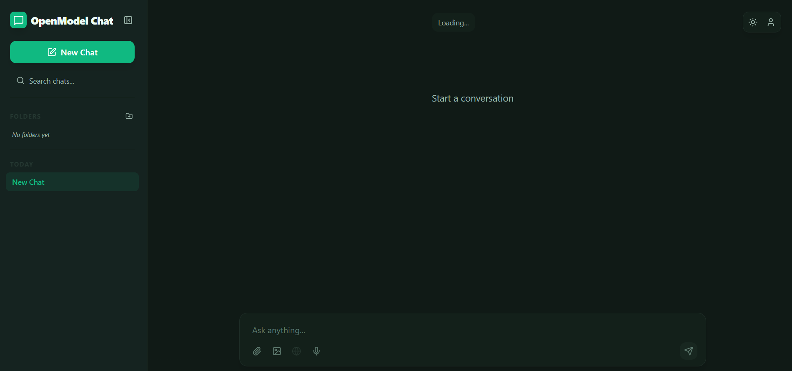
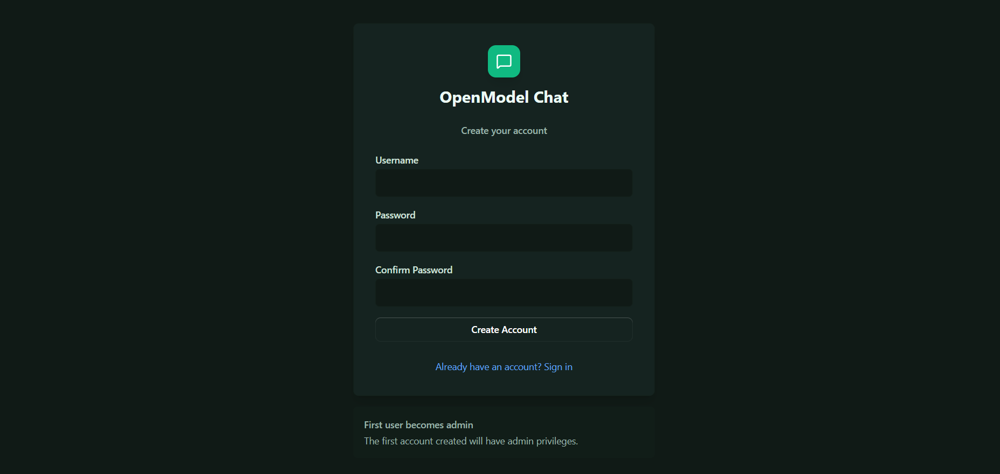
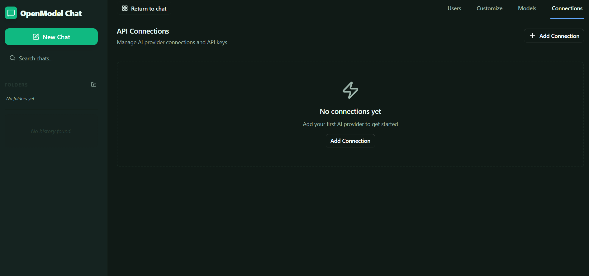
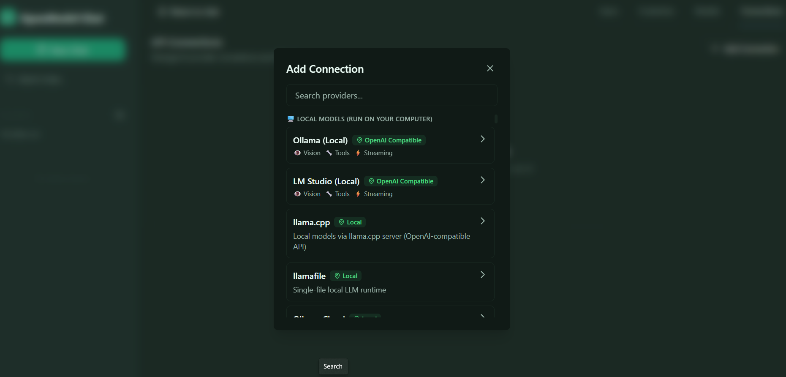

<p align="center">
  
</p>

<h1 align="center">💬 OpenModel Chat</h1>

<p align="center">
  <strong>A production-grade, privacy-first AI chat platform</strong> — streaming responses, cross-conversation memory, web search, image generation, voice I/O, and a multi-user admin console.
</p>

<p align="center">
  <a href="https://preactjs.com/"></a>
  <a href="https://hono.dev/"></a>
  <a href="https://tailwindcss.com/"></a>
  <a href="https://tanstack.com/router"></a>
  <a href="https://tanstack.com/query"></a>
  <a href="https://bun.sh/docs/api/sqlite"></a>
  <a href="https://bun.sh/"></a>
  <a href="https://sdk.vercel.ai/"></a>
  
  <a href="https://opensource.org/licenses/MIT"></a>
</p>

---

> **A complete, full-stack AI chat application.** Works with any LLM provider — OpenAI, Anthropic, Google, Groq, DeepSeek, xAI, Ollama and more — or runs **completely offline** with local models. Your data stays on your machine: no vendor lock-in, no tracking, full control.

---

## 📸 Project Showcase

<p align="center">
  
</p>

<p align="center">
  <em>The chat workspace — sidebar navigation, folder organization, search, pinned chats, and a streaming AI conversation.</em>
</p>

<p align="center">
  
  
</p>

<p align="center">
  
</p>

<p align="center">
  <em>Branded authentication, a complete admin console, and a rich settings experience with themes, fonts, voice, and memory controls.</em>
</p>

---

## ✨ Why This Project

This is not a tutorial demo — it's a **production-ready product** I designed, built, and shipped end-to-end. It demonstrates the exact engineering a client cares about:

- 🏗️ **Full-stack ownership** — a modern SPA frontend, a hardened REST API, a database layer, and deployment config all in one monorepo.
- 🔐 **Security done properly** — password hashing, encrypted secrets, SSRF protection, rate limiting, RBAC, and security headers.
- 🧪 **Real testing discipline** — **460 passing tests** covering API routes, auth, file security, and critical UI behavior.
- ⚙️ **Scalable architecture** — provider abstraction, pluggable AI models, and a theme system built in from day one.
- 🚀 **Fast & lightweight** — a ~3 KB Preact runtime, no SSR overhead, and an instant, fluid UI.

---

## 🚀 Key Features

| Category | Highlights |
|---|---|
| 💬 **Chat** | Real-time token streaming (Vercel AI SDK), markdown with Shiki syntax highlighting, LaTeX via KaTeX, inline editing, source citations |
| 🤖 **100+ AI providers** | 17 built-in (OpenAI, Anthropic, Google, Vertex, Bedrock, Azure, Groq, Mistral, xAI, DeepSeek, Cohere, Fireworks, Cerebras, OpenRouter, Replicate, Ollama, LM Studio) + **180 auto-discovered** via models.dev |
| 🧠 **Cross-chat memory** | The AI learns your preferences, projects, and style across conversations — with per-user and per-chat control |
| 🔍 **Web search** | Autonomous web search with SSRF-protected fetching, real-time status, and clickable source citations |
| 🖼️ **Images** | Vision/multimodal uploads + AI image generation (DALL·E 3, FLUX, OpenRouter) with inline preview and download |
| 📎 **Attachments** | Files, office docs, and images with previews, downloads, and security validation |
| 📥 **Import** | One-click conversation import from ChatGPT exports |
| 🎨 **Themable UI** | 15+ curated themes, dark/light mode, custom fonts and sizes — fully theme-aware CSS-variable system |
| 🎤 **Voice** | Speech-to-text input and text-to-speech output with voice selection |
| ⌨️ **Power user** | Keyboard shortcuts, virtualized chat lists, drag-and-drop files, folder organization, search |
| 👥 **Multi-user** | Authentication with roles (admin / member / readonly), user management, password resets |
| 🎭 **Customization** | Change the app name, logo, and branding from the admin panel |
| 🔌 **Provider Hub** | Discover and add providers with one click, pull Ollama models right from the UI |

---

## 🛠️ Tech Stack

| Layer | Technology |
|---|---|
| **Frontend** | Preact 10, TanStack Router, TanStack Query, Tailwind CSS 4, Zustand, Vite 7 |
| **Backend** | Hono 4, Bun runtime, Vercel AI SDK (multi-provider streaming) |
| **Database** | SQLite via `bun:sqlite`, encrypted API-key storage |
| **Validation** | Zod schemas at every system boundary |
| **Auth** | Session cookies, Argon2 password hashing, role-based access control |
| **Quality** | 460 tests (Vitest + Bun test), oxlint, Prettier, typed contracts in a shared package |
| **Deploy** | Docker, Caddy (HTTPS), Fly.io, Render, Railway |

---

## 🏗️ Architecture

```
┌────────────────────────────────────────────────────────────┐
│                    Preact SPA (Vite)                        │
│   TanStack Router  ·  TanStack Query  ·  Zustand  ·  AI SDK │
└───────────────────────────┬────────────────────────────────┘
                            │  REST /api (streamed responses)
┌───────────────────────────▼────────────────────────────────┐
│                        Hono API (Bun)                       │
│   Auth · RBAC · Rate limits · Security headers · Validation │
├───────────────────────────┬────────────────────────────────┤
│  Provider Factory (100+)  │  Web Search · Image Gen · Memory │
│  models.dev auto-discovery │  SSRF-protected fetch · AI tools │
├───────────────────────────┴────────────────────────────────┤
│                    SQLite (bun:sqlite)                      │
│   Users · Chats · Files · Folders · Settings · Memories     │
│   AES-encrypted provider API keys                           │
└─────────────────────────────────────────────────────────────┘
```

A **shared workspace package** (`@openmodel/shared`) defines the contracts — constants, schemas, and formatters — used by both frontend and server, so the API surface stays in sync.

---

## 🔐 Engineering & Security Highlights

- **Argon2** password hashing and **session-based** authentication with role enforcement.
- **Server-side AES encryption** of provider API keys — keys are never stored in plain text.
- **SSRF protection** — DNS-level validation and private-IP blocking on all URL fetching.
- **File security** — dangerous file types (SVG/XSS, executables) are rejected at upload time.
- **Rate limiting**, CORS policy, and security response headers applied globally.
- **Zod validation** at every boundary — no untrusted input reaches the database.
- **460 automated tests** covering the full API surface, auth flows, file security, and critical UI logic.

---

## ▶️ Getting Started

**Prerequisite:** [Bun](https://bun.sh/)

```bash
git clone https://github.com/saurabhdiwate/openmodel-chat.git
cd openmodel-chat
bun install
bun run dev
```

- 🖥️ **Frontend:** http://localhost:3000
- 🔌 **API:** http://localhost:3001

On first run the server generates an encryption key and initializes the database automatically. Register the first account — it becomes the **admin**.

```bash
bun run lint        # oxlint
bun run test        # 420 server tests
bun run test:frontend # 40 frontend tests
bun run build       # production build
```

---

## 🐳 Docker Deployment

```bash
docker compose up -d
```

Production-ready with automatic HTTPS via Caddy:

```bash
docker compose -f docker-compose.yml -f docker-compose.caddy.yml up -d
```

Also ships with ready-to-deploy configs for **Fly.io**, **Render**, and **Railway**.

---

## 🗺️ Roadmap

- 📤 Chat export (JSON / Markdown) and Claude import
- ✏️ Inline message editing and full-text message search
- 🎛️ Per-chat system prompts and temperature control
- 🧩 Personal prompt templates

---

## 👨‍💻 About the Developer

<p align="center">
  <strong>Saurabh Diwate</strong> — Full Stack Developer at <strong>Qoptervzn Infocom Pvt Ltd</strong><br>
  Building fast, secure, and beautiful full-stack applications end-to-end.
</p>

<p align="center">
  <a href="https://github.com/saurabhdiwate"></a>
</p>

---

## 📄 License

MIT — see [LICENSE](LICENSE) for details.
