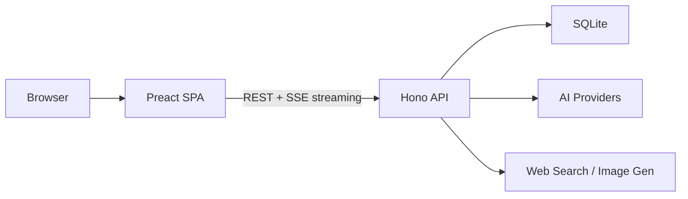
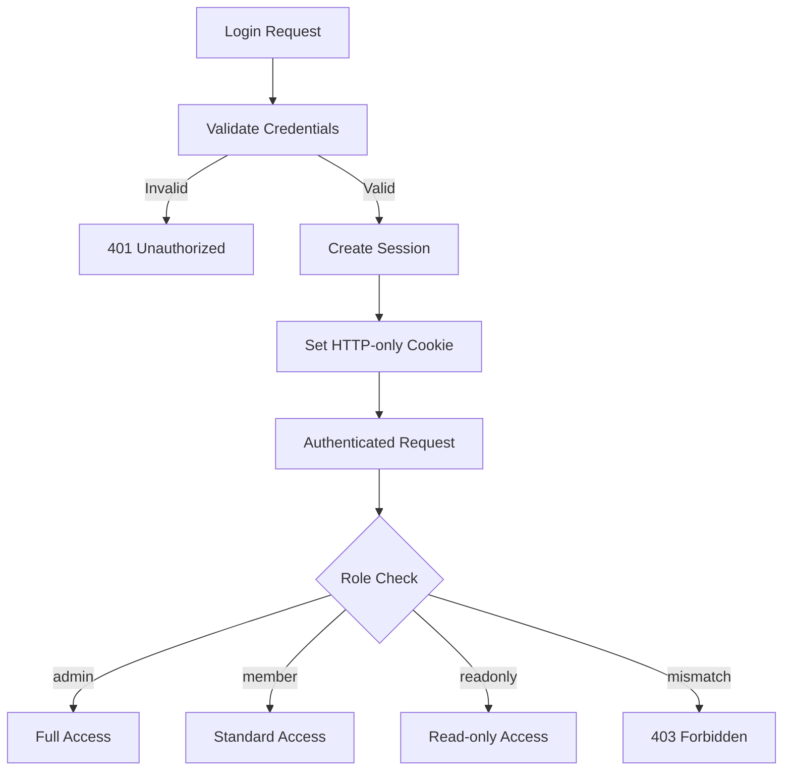
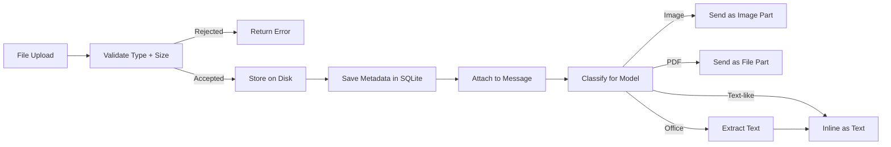

# Architecture

OpenModel Chat is a full-stack AI chat application built as a monorepo with three workspace packages.

## High-Level Overview



## Monorepo Structure

```
openmodel-chat/
├── frontend/           # Preact SPA (Vite, TanStack Router/Query, Tailwind 4)
├── server/             # Hono API server (Bun runtime)
├── packages/shared/    # Shared constants, schemas, formatters
├── scripts/            # Deployment and maintenance helpers
└── docs/               # Documentation
```

## Frontend

**Stack:** Preact 10, TanStack Router, TanStack Query, Tailwind CSS 4, Zustand, Vite 7

| Concern | Technology |
|---------|------------|
| Routing | TanStack Router (file-based) |
| Server state | TanStack Query (cache + invalidation) |
| Client state | Zustand (UI-only: modals, theme, filters) |
| Styling | Tailwind CSS 4 with CSS-variable theme system |
| Streaming | Vercel AI SDK (`@ai-sdk/react`) |
| Build | Vite 7 with Preact preset |

### Key Patterns
- **No TypeScript** — `.jsx` components, `.js` utilities, JSDoc at boundaries
- **Feature-based folders** — `components/chat/`, `components/admin/`, not `components/buttons/`
- **Derive, don't duplicate** — computed values as expressions, not `useState`
- **Server state via TanStack Query** — no API data duplication in local state

## Server

**Stack:** Hono 4, Bun runtime, Vercel AI SDK, SQLite

| Concern | Technology |
|---------|------------|
| HTTP framework | Hono 4 |
| Runtime | Bun (native SQLite, native fetch) |
| Database | SQLite via `bun:sqlite` |
| AI integration | Vercel AI SDK (multi-provider streaming) |
| Validation | Zod schemas at every boundary |
| Password hashing | Argon2 (`@node-rs/argon2`) |
| Secret encryption | AES-256-GCM (Node.js crypto) |

### API Routes

| Route | Purpose |
|-------|---------|
| `/api/auth/*` | Registration, login, logout, session, password change |
| `/api/admin/*` | User management, audit log, chat purge |
| `/api/admin/providers/*` | Provider CRUD, model enable/disable, API key management |
| `/api/chats/*` | Chat CRUD, messages, completions (streaming), pin/archive |
| `/api/files/*` | File upload, download, content delivery |
| `/api/folders/*` | Folder CRUD, chat organization |
| `/api/images/*` | AI image generation |
| `/api/import/*` | ChatGPT export import |
| `/api/memory/*` | Cross-chat memory management |
| `/api/models/*` | Model listing and admin management |
| `/api/settings/*` | App settings, web search config |
| `/api/version/*` | Version info, release check |

### Middleware Stack

Applied in order to every `/api/*` request:

1. **Security headers** — X-Content-Type-Options, X-Frame-Options, CSP, etc.
2. **CORS** — origin restriction in production, localhost in development
3. **Body limit** — 50 MB max request size
4. **Rate limiting** — per-user on auth endpoints
5. **Session auth** — `ensureSession` middleware on protected routes
6. **Role enforcement** — `requireRole('admin')` on admin routes

## Shared Package

`packages/shared` (`@openmodel/shared`) defines contracts used by both frontend and server:

- **Constants** — file size limits, session durations, memory config
- **Schemas** — Zod validation schemas for API payloads
- **Formatters** — file size, price, context window formatting
- **File classification** — MIME type mapping, category definitions, unsafe content detection

This keeps the API surface in sync between client and server without runtime type checking.

## Database

SQLite via `bun:sqlite` with the following tables:

| Table | Purpose |
|-------|---------|
| `users` | User accounts with Argon2 password hashes |
| `sessions` | Session tokens with expiration |
| `providers` | AI provider configurations (name, base URL, encrypted API keys) |
| `models` | Model metadata and enable/disable state |
| `chats` | Chat conversations with ownership, folders, pin/archive state |
| `messages` | Chat messages with role, metadata, model attribution |
| `message_files` | Junction table linking messages to file attachments |
| `files` | Uploaded file metadata and storage references |
| `folders` | User-created folder organization |
| `settings` | Application settings (app name, logo, web search key) |
| `user_memories` | Cross-chat memory facts per user |
| `model_metadata` | Cached model metadata from providers |
| `audit_log` | Admin action audit trail |
| `schema_migrations` | Migration tracking |

### Production Optimizations
- WAL journal mode
- NORMAL synchronous mode
- Memory-mapped I/O
- Foreign key constraints enforced

## Authentication & Authorization



- **Registration:** Only the first user can register (becomes admin). Subsequent registration requires admin action.
- **Sessions:** Stored in SQLite with periodic cleanup of expired sessions.
- **RBAC:** Admin can manage users/providers/settings. Member can chat and manage own data. Readonly can view only.

## AI Provider Layer

The provider system supports 100+ AI providers through a factory pattern:

1. **Provider registration** — admin adds provider with base URL and API key
2. **Key encryption** — API keys encrypted with AES-256-GCM before storage
3. **Model discovery** — automatic model fetching from provider APIs or models.dev
4. **Streaming** — Vercel AI SDK handles multi-provider streaming uniformly
5. **Fallback** — title generation falls back to content truncation if AI fails

Supported provider types:
- **Official SDKs:** OpenAI, Anthropic, Google, Vertex, Bedrock, Azure, Groq, Mistral, xAI, DeepSeek, Cohere, Fireworks, Cerebras
- **OpenAI-compatible:** OpenRouter, Replicate, LM Studio, llama.cpp, llamafile
- **Local:** Ollama (auto-discovered from local instance)
- **Auto-discovered:** 180+ models via models.dev registry

## File Handling



- **Upload validation:** File type classification, size limits, dangerous type rejection
- **Storage:** Files stored on disk with sanitized filenames and unique IDs
- **Attachment:** Files linked to messages via junction table (supports ordering)
- **Model preflight:** Checks provider/model support before sending (vision, PDF, etc.)
- **Content delivery:** Content-Disposition headers set based on file category

## Deployment

The application ships with deployment configurations for multiple platforms:

| Platform | Config | Notes |
|----------|--------|-------|
| Docker | `Dockerfile`, `docker-compose.yml` | Multi-stage build, SQLite volume |
| Docker + HTTPS | `docker-compose.caddy.yml` | Caddy reverse proxy with auto-TLS |
| Fly.io | `fly.toml` | Persistent volume, auto-scaling |
| Render | `render.yaml` | Free tier, persistent disk |
| Railway | `railway.json` | Docker-based deployment |

All deployment targets use the same Docker image. The server auto-generates an encryption key on first run if not provided.
